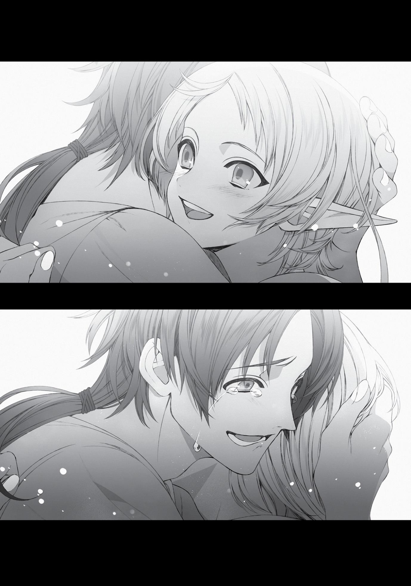

+++
title = "Chapter 7: The Third Turning Point"
date = 2026-07-20
weight = 7
[extra]
volume = 11
chapter = 8
+++

right now, the device was so thirsty for power that Cliff couldn’t even
keep it running for an hour.
“We’re going to try to keep honing the design, but I could really
use your help. Without you, we’d only be able to charge the thing up
a few times a day.”
“Ah, right. Okay, then. I’ll help out when I can.”
Cliff considered himself a genius magician, and his mana
capacity was certainly on the greater side. But even so, it wasn’t
close to enough. This was exactly where I could come in handy.
From that day on, I started to help out with Cliff’s experiments,
too.
Incidentally, the device did nothing to make Elinalise any less
horny.
Lately, I felt like my life had settled into a smooth and pleasant
rhythm.
I woke up in the morning, did my training, ate breakfast, and
went to the University. I stopped by to see Zanoba and then Cliff,
checking in on the progress of their research and occasionally
offering some advice. After lunch, I headed over to help out
Nanahoshi with her summoning experiments. And once classes
ended, I took an hour to tutor Norn.
On my way back home, I went grocery shopping with Sylphie,
and Aisha greeted us at the front door. Sylphie and I took a bath
together, and the three of us ate dinner. Then we practiced magic in
the living room and talked about our days.
After Aisha went to bed, I worked on the baby-making project
with Sylphie, then fell into a sound sleep with my wife as my body
Page | 137

pillow. Each day went much like the one before it, but I still felt like I
was making steady progress toward my goals.
Maybe this was what happiness felt like?
It wasn’t something I’d gotten much of in my first try at life. But
assuming Paul made it back safe and sound in a year or so, things
should only get better from here.

Page | 138

Chapter 7:
The Third Turning Point

L

IFE COMES AT YOU

fast sometimes.

I was doing my usual training routine one pleasant summer
morning, feeling good about things in general. I hadn’t seen Badigadi
around for months but wasn’t too concerned. The man was
impulsive at the best of times, so there wasn’t much point worrying
about him.
That was what Elinalise always said, at least. And it had proven
to be true so far.
When I finished up and went back into the house, I found Aisha
and Sylphie in the hallway with serious expressions on their faces.
They turned to look at me as I stepped in the door.
“Oh…”
“Rudy…”
Something about the atmosphere in here was making me
nervous. Did we have a problem or something?
“Err…” said Sylphie, scratching at the back of her ears with an
awkward smile. “Haha, wow. This is making me more nervous than I
expected…”
“There’s no reason to hesitate, Sylphie!” said Aisha. “Go on! Be
brave!”
My wife stepped forward. After a moment’s hesitation, she
crossed her hands in front of her stomach and spoke. “Well, Rudy.
It’s actually…been two months now. Since my last, uh, you know…”
Her last…? Oh. Oh, wow.
“And, well, I haven’t been feeling so well lately, and I was
starting to wonder.”

Page | 139

I couldn’t help myself from staring at Sylphie’s stomach. It didn’t
look any different at the moment. Was this really happening?
“So I went with Aisha to the neighborhood doctor, and…they
said, uh, congratulations.”
“Oh… Ohhh…”
My voice was trembling. So were my hands. And my legs, for
that matter.
Congratulations? She was pregnant? We were actually going to
have a kid. This wasn’t a dream, right?
An experimental pinch of my cheek made me wince. So much
for that theory.
I swallowed loudly.
Right. Of course. Why wouldn’t she be pregnant? I was a man
who could make things happen, when I really set my mind to it. This
had always been part of the plan. I just hadn’t been expecting it to
happen so quickly, since everyone said elves had a hard time getting
pregnant.
I was a little startled—that was all.
“Uhm, Rudy…any thoughts?”
Sylphie was looking at me anxiously. I wasn’t sure what to say,
though. This was all so sudden.
“Can I, uh…touch your stomach?”
“Huh? Err, sure. Go ahead.”
I reached down and stroked Sylphie’s belly. It was still slender,
with no additional fat that I could feel. Her skin was warm to the
touch and surprisingly soft. The same as always, in other words. But
when I focused closely, I felt like I could feel a slight hint of a bump.
That was probably just my imagination, right? The kid wouldn’t
be that big yet.
Page | 140

“Right… Our kid’s in here…”
When I spoke those words out loud, I felt a sudden surge of
emotion building up inside me. What was this feeling? I had to
repress the urge to start shouting incoherently.
I had a kid on the way. I was going to be a dad.
It didn’t feel real yet. But it still made me incredibly happy.
Was happy even the right term? The word felt so inadequate.
What was I feeling right now? Could you even put this into words?
“Brother dear? Isn’t there anything you’d like to say to your
wife?” Aisha’s words snapped me back to reality.
“Muh?”
Something I need to say? Like what? Congratulations? No, that
can’t be right.
Maybe I should thank her. Yeah, that sounds better.
“Thank you, Sylphie.”
“Huh?”
Sylphie smiled, but she looked a little puzzled. Had I guessed
wrong? What was the answer, then? I searched my memory for a
hint. What had Paul said to Zenith, back when we found out Norn
was on the way? Something like “Well done,” right? Or maybe “Nice
job!”
I didn’t like those options very much, though. Did he think
women only got pregnant when they tried really hard or something?
Maybe. Maybe he was that stupid.
…Pregnant, huh? Yeah. Sylphie’s pregnant. I got this sweet,
beautiful girl pregnant. Me, of all people.
The more I thought about it, the more my emotions threatened
to overwhelm me. I was actually starting to tear up.

Page | 141

“I’m sorry… I don’t, uh…think I know what to say. Sorry,
Sylphie…”
“Oof! Uhm, Rudy?”
Instead of continuing, I’d thrown my arms around Sylphie. I
wanted to lift her up into the air and spin her around a few times for
good measure, but this wasn’t the time for that. She had a baby in
her belly. I needed to be very, very gentle with her.
“Hehehe. You did want children pretty badly, didn’t you?”
My wife wrapped her arms around me as well, and started to
pat me on the back.

Page | 142

Page | 143

I gave her one more gentle squeeze, then finally released her.
Stepping back, I stared down into her eyes. I could see my face
reflected in them, and it wasn’t a pretty sight. I had tears running
down my cheeks.
Sylphie closed her eyes. I kissed her and stroked her hair,
enjoying the softness of her lips. This was what love felt like, wasn’t
it?
“Ahem.”
Aisha cleared her throat, reminding me that we weren’t alone in
the room. I’d started groping Sylphie’s breasts and butt without even
realizing it.
“Brother dear, we need to be gentle with the lady of the house
for a while. You’re going to need to refrain from…intercourse for the
moment.”
She’s right. Bad Rudeus! Bad!
No matter how lovable my wife was, I needed to control myself
from now on. Then again…she was less than two months pregnant,
right? And we’d been doing it every three days up until now. It
probably wouldn’t hurt to keep going just a little longer…
No! No. Keep it together, man.
“Right. Of course.”
Aisha smiled and lifted the hem of her skirt slightly upward. “If
you’re desperate, I’m always available to pick up the slack.”
“Not a chance in hell, kiddo.”
She pouted a little at that. It was nice of her to offer and all, but
even putting all the moral issues aside, I just wasn’t attracted to her.
That suited me fine, anyway. The last thing I needed was to destroy
my marriage by messing with the maid.

Page | 144

“Well, then, brother dear, I’m going to go inform Princess Ariel
of this development. I expect Miss Sylphie will need to put her work
on hold for some time, after all.”
That hadn’t even occurred to me, but she was right. You
wouldn’t want a pregnant woman working as a bodyguard. Sylphie
was going to need a leave of absence.
“I’ll go,” I said. “I should really explain the situation myself.”
Aisha sighed at me. “Rudeus, you really need to stay with
Sylphie for the moment. You’ve got lots to talk about, remember?”
Do we? Oh, right. I guess we do. This kind of changes
everything, after all.
“With that settled, I’ll be going now.”
“Right. Okay. Thanks, Aisha.”
My little sister left the house in high spirits, leaving me and
Sylphie behind by ourselves.
A few minutes later, the two of us were sitting next to each
other on the sofa.
I cautiously reached out to take Sylphie’s hand. She squeezed
mine back and leaned her head against my shoulder. Neither of us
said anything for a while.
I wasn’t sure where to begin, honestly.
The only words that were coming to me were variations of “I’ll
take responsibility for my actions.” But we were already married, so
that didn’t make much sense.
“Uhm, Sylphie…”
“Yes, Rudy?”
“I know this might be tough, but…we’ll do it together.”
“Well, I think I’ll be doing most of the work.”
Page | 145

Laughing softly, Sylphie laid down on the couch and put her
head in my lap. I used my free hand to stroke her head and rub
behind her ears.
“Hey, Rudy.”
“Yeah?”
“Do you want a boy or a girl?”
The question took me by surprise. I’d almost forgotten babies
came in two varieties.
“I mean, not that we really get to choose,” Sylphie added,
smiling gently.
Hmm. Which would be better?
Maybe a boy would be nice, just to have an heir to the family?
But it wasn’t like I was the head of some feudal clan or anything. We
could pass down everything to a girl just as easily…not that we even
had much of a fortune to be inherited at the moment.
Back in my old life, I probably would have said, “A girl!” with a
creepy grin on my face. Maybe even suggested that we take pictures
of her every single day to record her growth into adulthood. What a
very foolish man I used to be.
Right now, though, I couldn’t find any reason to prefer one over
the other. As long as it was a healthy, happy kid, I’d be satisfied
either way.
“You know, Rudy, I’m kind of relieved.”
“Why?”
“It feels like I’m really your wife now.”
“…”
Just like in my old world, having children was a major reason
why people got married here. Sylphie had probably been a little
anxious about that part of things, since it was harder for her people
Page | 146

to get pregnant. Not that I would have left her over something like
that, of course.
“Anyway, I guess this is going to be kind of rough on you too,
huh?” she said. “Since we can’t, uh, do it for a while.”
“Hey, I’ll live.”
I could put up with a dry spell under these circumstances. Unlike
certain old men I could mention.
“Feel free to kick me out of the house for good if I go off and
sleep with another woman, all right? I’d deserve it,” I said.
“…Oh, I don’t think I’d be that angry. Maybe a little sad. But I’d
understand.”
Really? That seemed like an awfully mild reaction. I wasn’t going
to betray her or anything, though. I knew I’d feel like total crap if she
went out and cheated on me.
“I think I’d get upset if you messed around with another guy, to
be honest,” I confessed.
Sylphie just laughed softly and smiled. It was an expression she
only ever wore around me. No one else ever got to see it. And that
made me really happy.
We spent some quiet time together.
In the evening, Aisha came back to our house with Norn in tow.
“C-congratulations, Sylphie,” said Norn, bowing politely.
“Thanks, Norn,” said Sylphie, smiling as she patted her on the
head.
That got Norn smiling as well. She didn’t seem to mind being
petted as much as you might think. Maybe she actually enjoyed it,
coming from the right person. In any case, it was nice to see the two
of them getting along so well.
Page | 147

“Everyone wanted to come by and congratulate you, but I
convinced them to postpone their visits for a few days,” said Aisha in
a calm tone of voice. She’d apparently assumed I would want to keep
this an intimate family occasion for today.
I didn’t remember suggesting anything of the kind, but it
seemed reasonable enough. Sylphie would probably be a little
embarrassed or overwhelmed to have a lot of people congratulating
all her at once. It was better to give it a few days.
“Princess Ariel indicated that Miss Sylphie is expected to take a
break from her duties for at least two years. She also said she would
arrange for a leave of absence from the school. Great-Aunt Elinalise
has volunteered to assume Sylphie’s bodyguard duties in the
interim.”
“Is Grandma really going to be okay? I mean, she has that curse
and everything…”
“She assured me that she could manage, Madam. I wouldn’t
worry about her.”
Elinalise did know how to take care of herself, and she had that
magical implement now. Besides, she could always pull Cliff into an
empty classroom or storage room if she needed to get busy during
school hours.
“Prince Zanoba says he’ll be paying us a visit five days from now,
in the evening. He wanted to have dinner with us, so I’ll get things
ready for that. Princess Ariel will be stopping by in ten days, also at
night, but she indicated that she wouldn’t be dining with us. Cliff and
Great-Aunt Elinalise will be coming along on that visit. Miss Linia and
Miss Pursena indicated they’d wander by sometime, but I don’t have
any details as to when that might be. Miss Nanahoshi offered a brief
message of congratulations to you both. I wasn’t able to find Lord
Badigadi, but I left a message for him.”

Page | 148

Aisha had rattled off the whole list of our friends quickly and
efficiently, in a steady tone of voice. It was like we had a personal
secretary or something. The girl was definitely good at her job.
“Got it. Thanks for letting everyone know, Aisha.”
“Of course, brother dear.”
Aisha looked over at Norn with a prideful smirk on her face.
Norn met her gaze with a frown.
Aisha still seemed to take a certain degree of malicious joy in
showing her sister up like this. There was some lingering conflict
between them involving their positions in the family. I was always
telling Aisha that she was an equal member of the family, and that it
didn’t matter if she had a different mother…but the two of them still
fought constantly, over the most minor things.
They did say squabbling with someone can be a sign of how
close you are. It was probably okay to let things be, as long as this
didn’t turn into a cold war. They never said anything really cruel to
each other when they fought, at least.
“I’ve got to say, though,” I murmured, “Dad’s probably going to
be shocked when he shows up and finds out I’ve got a kid coming.”
“Oh, yeah!” said Norn, her face lighting up at the mention of
Paul. She really did love her dad. I could see her putting down
“marrying my daddy” on her list of dreams for the future. “I can’t
wait to see the look on his face!”
“He’s the type to spoil his grandkids rotten, so I bet he’ll be
overjoyed,” I said. “He was really sweet when you two were born
too.”
Aisha and Norn both looked a little nonplussed for a moment.
Neither of them had any memory of those days, of course.

Page | 149

“Well, anyway! I’m really looking forward to it, Rudeus!” Norn
announced. Those unusually cheerful words put a smile on
everyone’s face.
Sylphie and I were happily married. Paul and Zenith and Lilia
would be with us soon enough. And my little sisters were here too.
That was the life I’d dreamed of way back in the Buena Village days,
and it was close at hand.
The bad news arrived two months later.
I received a letter, dated six months in the past. It had been sent
by express delivery post. The sender’s name was Geese. And the
contents, as was usual with express letters, were very brief.
“Having trouble rescuing Zenith. Requesting help.”
The instant I saw those words, the world flashed white before
my eyes.
When I came to, I found myself in a pure white space. I’d been
transformed back into the foul person I used to be, and felt a surge
of anger and resentment wash over me.
I stared sullenly at the figure in front of me. It was the smiling
Man-God, whose face was nothing but a blur.
“Hey, there.”
What the hell is going on?
“What are you talking about?”
That letter. The one from Geese. He said the rescue isn’t going
well. What’s the deal?

Page | 150

“Well, I expect it means the rescue isn’t going well. What do you
want from me?”
But that’s not what you told me! You said I’d regret it if I went
to the Begaritt Continent! What was all that about, then? Were you
lying to me?!
“No, of course not. You’ll regret it if you go to the Begaritt
Continent. It was true back then, and it’s still true now.”
Ah, now I see. I get it. I’ll regret it if I go to the Begaritt
Continent, but I’ll also regret it if I don’t go. Is that what you meant
all along?
“Oh, I don’t know about that. You weren’t too unhappy with
your life as of yesterday, were you? You made lots of friends here.
You met many interesting people, and you did a lot of growing up.
Your condition was cured, you made friends with your little sisters,
you even got married! And now you’ve got a kid on the way.”
…Yeah, my life’s not bad right now. But that’s not the point!
You told me not to go to Begaritt! You tricked me!
“I really didn’t, though. Let me repeat myself one more time: If
you go to the Begaritt Continent, you will definitely regret it.”
What? But my family’s in trouble! Tell me why, at least!
“Can’t do that, I’m afraid.”
Damn it! I should have known better. You’re always like this!
“You’re being awful harsh today. My advice has always proven
helpful, hasn’t it?”
Maybe, but that doesn’t change the fact that you misled me
this time. Look, can you at least give me some of the details? What
am I going to end up regretting? I can’t make this decision unless I
know the risks and rewards!
“Most people have to make their decisions blind, you know.
You’re awfully demanding.”

Page | 151

I don’t care if I’m being unreasonable. I don’t want to regret
my choices.
“Well, if you actually think it through, a few of the consequences
should be obvious. You spent the last year and a half as a student,
right? And your little sisters spent a year traveling here. If you’d gone
to Begaritt instead, you would have missed each other completely.”
What? But Paul sent my sisters here because he saw my letter.
If I hadn’t written to him, they would have stuck around in Millis or
waited in East Port.
“Not true. Even if he hadn’t gotten your letter, Paul would have
sent his kids to the Kingdom of Asura. Lilia’s got family there,
remember?”
…Sure, okay. I guess you’re right.
“Things aren’t so different now, really. Let’s say you set out on a
journey tomorrow. What happens to Sylphie and your kid? You
planning to leave her here, all alone, while you hike halfway across
the world?”
So basically, I’ll have some regrets no matter what I do.
“Naturally. It’s impossible to avoid having any regrets, I’m afraid.
If you head to Begaritt, you’re going to miss out on at least one
golden opportunity. The way I see it, you’re better off staying put.”
Tch.
Well… if you’re that sure about it, I guess I probably will end up
regretting it. Fine…
“Right. Well, then, want to hear my advice?”
Yeah, sure. Can’t hurt, I guess.
“Ahem. Rudeus, remain in Ranoa until the next mating season
comes around. Linia and Pursena will pursue you aggressively.
Choose one of them and begin a relationship with her. This will bring
you greater happiness in the end.”

Page | 152

What the hell?! You’re telling me to cheat on my wife now?!
I’m happy with Sylphie! And those two are just good friends, damn it!
His last words echoing dramatically in the air, the Man-God
disappeared. And I slipped back into unconsciousness.
I woke up to find myself in bed. Sylphie was looking down at me
with concern on her face.
“Oh, Rudy! Are you okay? You were moaning in your sleep.”
“Yeah, I’m fine…”
What had happened after I received that letter? I couldn’t
remember the specifics very well. I recalled staring at the page in a
stupor, but nothing else except my dream.
Things had been going too smoothly lately. I guess the shock
had hit me hard.
Geese’s letter was alarming. Something had obviously gone
wrong. Still, I had the Man-God’s words to consider. If I set out on
now, there was a chance my family and I would pass each other on
the road and I’d waste a couple years of my life.
Maybe this was too optimistic, but…there was a chance that
Geese had just sent out that letter in a moment of panic. I mean, it
wasn’t Paul who had written to me. It was Geese. My monkey-faced
cellmate.
Why would he write me a letter like this? Because he was trying
to rescue Zenith too? But Paul’s last letter hadn’t mentioned him. It
seemed likely Geese had found Zenith on his own.
The letter was written six months ago. It was possible he’d been
alone and feeling helpless at the time but had met up with Paul and
the others since then. Maybe he’d even sent a similar letter to Paul.
Page | 153

They might have joined forces and rescued my mother a couple
weeks later.
All of these were just possibilities, of course. I had absolutely no
way of knowing what the situation really was. Not from this great a
distance.
There was Sylphie’s child to think of too. No matter how fast
you traveled, it had to be a solid year’s journey to reach the Begaritt
Continent. I knew the road down to East Port from my last big
journey, so it was possible I could cut the travel time down
significantly. But even if I somehow managed to get there in six
months, I wouldn’t be back home for at least a year.
That wasn’t going to work, right? I couldn’t just leave my
pregnant wife all alone to go on some adventure.
“This is about that letter, isn’t it?”
“…”
I couldn’t bring myself to answer. I’d promised Sylphie I
wouldn’t disappear on her again. I’d given her my word.
It wouldn’t technically be “disappearing” if I explained
everything beforehand. But that was just semantics. Even if we
talked it through beforehand—or if I left her a thorough letter—it
would still be agonizing for her to be left behind.
“Uhm, Rudy…you don’t have to worry about me too much,
okay? I’ve got Aisha here to take care of me.”
There was just a hint of anguish on Sylphie’s face. She was
anxious, of course. This was her first pregnancy. Her belly was
already getting bigger by the day. Sooner or later, it would be hard
for her just to get up and down the stairs. And there was a chance I
might die on this journey. I might never come back to her.
She’d fought down that fear to speak those words.
“…I’m not going anywhere. I’ll stay with you, Sylphie,” I said.
Page | 154

When I said that, she smiled, though she still looked a little
conflicted.
The words of the Man-God continued to linger in my mind. No
matter what choice I made, he’d insisted, I was going to end up
regretting it.
The next three days were long and difficult.
Every time I saw them, Sylphie, Aisha, and Norn had anxious
looks on their faces. I’d already told them I wasn’t going to the
Begaritt Continent, but the more I thought about it, the more
uncertain I felt. I was torn between my two choices, and there
weren’t that many people I could turn to for advice.
The first, Elinalise, nodded when I told her of my intentions. “I
think that’s wise, Rudeus. You’re better off staying behind for this
one.”
The way she phrased that surprised me. It suggested she had
other plans. “Are you going to go, Elinalise?”
“Sylphie’s my granddaughter, Rudeus. It’s only right that I take
this job, for her sake as much as yours.”
Apparently, she’d received an identical letter herself. And unlike
me, she was ready and willing to go, even if it meant leaving her life
here behind.
“Aren’t you supposed to be guarding Princess Ariel, though?”
“There’s very little real danger to her life while she’s enrolled in
this school. I wasn’t doing much of anything, to be honest.”
That was probably true most of the time, but you never knew
when things might take a dangerous turn. That was the whole point
of having bodyguards. But of course, that was Ariel’s decision to
make, and Elinalise had basically volunteered herself as a goodwill
gesture. I doubted the princess would object to her backing out.
Page | 155

“What about Cliff?”
“I’ll have to leave him. He might hate me forever, but I don’t
have much choice.”
“Why don’t you at least explain the situation? I’m sure he’d
understand.”
Elinalise shook her head with a melancholy smile. It didn’t look
much like her usual smirk.
“Cliff’s a pure-hearted young man. He has talent, drive, and
vision. I wouldn’t be surprised if he becomes the pope one day. He’s
better off remembering me as nothing but a youthful indiscretion.”
Well, that just made me feel terrible for the guy.
Members of the Millis church were expected to stay loyal to a
single person. If Elinalise just disappeared, it might shake the very
foundations of Cliff’s faith. He was a strong-willed person, but it was
hard to know what losing his religion might do to him.
“And also…I’m the one who told you to stay here last time. That
makes cleaning up this mess my responsibility, don’t you think?”
Elinalise’s words were so firm and clear that I found myself at a
loss for words.
Apparently taking that as agreement, she nodded. “You just
leave this to me and wait here, dear. I want to see a happy greatgrandchild waiting for me when I make it back.”
It was clear that nothing I could say was going to change her
mind.
Next, I turned to Zanoba for advice. His expression didn’t even
change as I laid out the story.
“I see,” he said calmly. “Well, I’m sure you’ll deal with this
matter easily enough and be back before too long. I will remain here

Page | 156

and continue to pursue my research, but I do hope you’ll return as
quickly as possible.”
“I kind of thought you’d ask me not to go, Zanoba. Or demand
that I bring you along.”
When we parted back in the Shirone Kingdom, he’d wept and
hung all over me. A part of me had been hoping for something
similar. But this time, his attitude was very different.
“Should you wish for me to accompany you, I would be loath to
refuse. But I’m unaccustomed to lengthy journeys, and I fear I might
prove a burden. And of course…” He shot a glance over at Julie. “I
couldn’t bring the girl on such a trip.”
Julie was still a young child. Leaving her here in Ginger’s care
was an option, but that would mean putting their studies and
research on hold. And if she came along instead, it would be
dangerous to have her keep exhausting herself by using up all her
mana.
“Do you think I should go, Zanoba?”
“That is your decision to make, Master.”
He sounded almost dismissive now. I’d been hoping for some
actual advice…
“However, if I may make one observation?” he said.
“Hmm?”
“The birth of a child does not require a father’s presence. If
you’re worried about your parents, why not go to their aid? I’ll
guarantee the safety of your wife and sisters in your absence.”
There was real conviction in Zanoba’s words. It made sense that
royalty would have a different perspective on this sort of thing,
though. Most kings probably didn’t rush to watch their concubines
giving birth.

Page | 157

“I would of course prefer to have you at my side constantly,” he
said, “but the choice is yours.”
“You make some decent points, Zanoba. Thanks for the advice.”
Sylphie wasn’t on her own here. She had Aisha, Zanoba, and
Princess Ariel’s retinue.
She wasn’t alone. We weren’t alone.
What was I supposed to do at the end of the day? Stay or go?
Elinalise wanted me to wait here while she went to Begaritt
alone. Zanoba wanted me to go, leaving matters here in his hands.
Which path made more sense? Where was I most needed right now?
Zanoba’s logic seemed sound. As long as Sylphie stayed healthy,
everything would be just fine. My presence wasn’t going to make a
difference. Still, that attitude didn’t sit right with me. I wasn’t a king,
and I didn’t want to act like one. It was obviously better for Sylphie
to have me here, providing emotional support.
Sylphie had encouraged me to go, and told me not to
worry…but this was her first pregnancy. Deep down, I knew she had
to be terrified. She was probably fighting the desire to break down
and beg me not to leave.
I was the one who’d told her how I wanted kids over and over
again. I might not even have been that serious about it at the time,
but she’d obviously taken it seriously. And now that she was actually
pregnant, I was thinking about leaving her behind while I traveled
halfway around the world. That felt like a serious betrayal.
On the other hand…I had to admit that I’d been putting off my
responsibility to help Paul for a long time now. I’d put my own
happiness first for years. Hell, I’d prioritized fixing my “performance”
problems over the search for my mother.

Page | 158

Maybe this was a wake-up call. Maybe it was finally time for me
to pay the piper.
…I couldn’t make up my mind. Both options would cost me
greatly.
It was now the fourth day after the letter’s arrival. I’d spent
most of that time brooding over my dilemma. I wasn’t sleeping well
at all, and I couldn’t motivate myself to bother with my usual training
routine that morning. I was just sitting around on the first floor,
bleary-eyed, doing nothing in particular.
The mornings were chilly here, even in summer, and I was
feeling downright sluggish. For a while, I just watched the sun rise.
“…Oh!”
After a while, I heard a small cry of surprise from behind me.
Turning around, I saw that our front door was open, and Norn was
standing in front of it. She had a large bag on her back—the same
one I’d used in my days as an adventurer. It was packed to bursting
point.
She was obviously preparing for a lengthy trip. But because she
was only ten years old, it looked more like she was going on a picnic
or something.
For a long moment, I just looked at her silently. Norn avoided
my gaze. She looked like a kid who’d just been caught red-handed
playing a prank on someone.
“Where are you off to?”
“…”
Norn didn’t answer, so I repeated myself. “Where are you going,
Norn?”
Biting her lip, she finally looked me in the eye. “W-well… if
you’re not going to help, Rudeus, I guess I have to go instead.”
Page | 159
