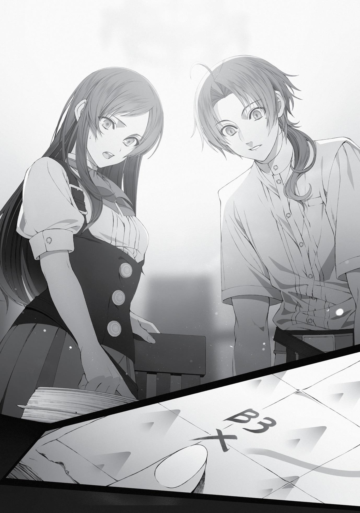

+++
title = "Chapter 9: To Begaritt"
date = 2026-07-20
weight = 9
[extra]
volume = 11
chapter = 10
+++

That hadn’t occurred to me until now, but it was true. They
were sixth-year students. Two years from now, they would probably
be back in the Great Forest.
It made me a little sad that I wouldn’t get to see them off.
“I guess you’re right. That’s a shame…”
Come to think of it, the Man-God had encouraged me to “begin
a relationship” with one of these two. If I’d chosen to hang around
here until the mating season started in two months, things might
have taken a turn in that direction.
“What’s up, Boss? Do I have something on my face?”
Linia was an attractive girl. Those twitchy cat ears, swaying tail,
and healthy thighs were her most distinctive features, but she had
big breasts too. What was she, an E cup? All the beastfolk girls were
on the well-endowed side, so that was probably about average. That
cocky attitude would probably make her fun in bed too.
“Sniff sniff…whoa! Thinking about goin’ a round with us before
ya leave, Boss?”
Pursena had her charms, too. Those soft, floppy dog ears and
her voluptuous body were her most notable assets. Dog-type
beastfolk seemed to have particularly big breasts for some reason;
she had to be a G cup. I’d groped those things a few times, so I knew
how soft they were. How good would it feel to bury your face in
them? Hmm…
“Uh, sorry,” I said. “Someone recently advised me to make a
move on you two once the mating season comes around. I was just
remembering what they said.”
“Whoa, seriously? Didn’t know you were even interested!”
“Ya never really flirted back, so we figured we weren’t your
type.”
The two of them seemed surprised, but also more than a little
amused.
Of course, sleeping with them would have meant cheating on
my wife. But from what the Man-God said, it sounded like Sylphie
wouldn’t have kicked me out of the house over it. Would she really
just forgive me for messing around while she was pregnant? Maybe
there’d be an ugly fight before things calmed down? Hard to say.
Either way, it would supposedly lead to “greater happiness” in the
end.
I loved my wife, but I was also a man. The idea of a harem had a
certain appeal. I found myself picturing a foursome with Linia,
Pursena, and Sylphie. In some alternate reality, could that have been
my future?
…Nah, probably not. It was never a real possibility.
“Linia, Pursena…”
“Yeah?”
“What’s up, Boss?”
Linia and Pursena looked at me nervously. I guess I’d spoken in a
slightly stern tone of voice.
“Let’s stay friends,” I said.
The two of them instantly relaxed and shrugged their shoulders.
“Well, if you insist,” said Linia, elbowing me in the side. “A guy
like you could use a few.”
“Friends it is,” said Pursena, elbowing me in the other side.
“Make sure you keep in touch.”
We ended up exchanging handshakes before we parted—
probably a first for us, actually. Some people like to say it’s
impossible for men and women to really be friends, but that isn’t
true. You can be friends with someone you’re attracted to; it’s a just
a matter of setting the right boundaries.
“Let’s meet again someday, all right?” I said. “Even if it’s ten or
twenty years from now.”
“Sounds good, Boss. We’ll both be big shots ten years from now,
so you can bow down before us and kiss our shoes!”
“We’re gonna conquer the Great Forest, man.”
I had to smile. Good to know they had ambitions, at least. “Well,
I hope you don’t take revenge on me or anything.”
And so we went our separate ways. If we were lucky, maybe
we’d see each other again sooner or later.
A little later, I found myself standing in front of Nanahoshi’s
laboratory.
I wasn’t sure how to break the news to her. Nanahoshi was a
lonely girl at heart. For all her outward hostility, I got the sense she
was desperate for company. And more importantly, my absence was
going to disrupt her research. Her plan to return home would be
delayed significantly.
I had to imagine she was going to try to convince me not to go.
She might even blackmail me somehow. What was I supposed to do
if she threatened to murder Sylphie if I left? Not that I expected her
to go that nuts…
Letting out a small sigh, I knocked on the front door and waited.
The “come in” came a moment later.
Nanahoshi looked up from her desk as I stepped into the room.
“What is it? This isn’t your usual time…”
“I’m afraid I’ve got some unfortunate news, actually.”
“Unfortunate news?”
Nanahoshi’s expression turned suspicious. I spent a few seconds
debating how to begin, before deciding that it didn’t really matter.
Best to get straight to the point.
“I’m going on a lengthy journey. My parents are in danger, and I
need to help them. They’re in the Labyrinth City of Rapan in the
Begaritt Continent. It’s going to be about two years before I’m back.”
“…What?”
After a moment of silence, Nanahoshi jumped to her feet,
knocking her chair backward with a clatter. She pressed her hands
down on her desk and stared at me, looking more stunned than
anything.
“Rapan? Begaritt? Did you say…two years?”
She repeated the words slowly, as if trying to make sense of
them.
“I know I said I’d help you with your experiments, and I do feel
terrible about leaving now. But I really need to go.”
Nanahoshi’s eyes opened wide, and she took a great gulping
breath…but instead of shouting, she dropped back into her chair and
looked up at the ceiling.
“Two years…” she repeated.
“Once I get back, I promise to help you again as much as I
possibly can.”
“…Two years…”
Nanahoshi folded her arms and muttered the words to herself a
few more times.
She didn’t try to stop me or cry out in despair. She just looked
up at the ceiling, apparently deep in thought. We spent five
extremely awkward minutes like this.
“Well…I guess I’ll be going, then,” I said.
There wasn’t much else I could say here. Nanahoshi knew I’d
been helping her out of the goodness of my heart. She probably
wanted to change my mind about leaving but was choosing to bite
her tongue.
I turned around to leave…
“Hold on just a minute,” she said.
And then I stopped in my tracks.
To be honest, I didn’t want to continue this conversation. I knew
she was just going to try to stop me. But it felt like I owed her a full
explanation, so I turned back around.
Nanahoshi was rooting around in the bottom drawer of her desk
for some reason. After a moment, she took out some kind of book or
journal. She flipped through it to a specific page, then turned it
around to show me. “Take a look at this.”
I leaned forward curiously. Someone had pasted a section from
a map onto the page. The map looked familiar enough; it depicted
the area around this city, although the scale was a little on the larger
side.
Near the top of the map, someone had scribbled the characters
N1. Down in the southwestern forest was a red X with the characters
B3 above them.
“What is this, Nanahoshi?”
“…”
Nanahoshi was obviously hesitant to explain. But after a few
moments, she spoke up.
“It’s a map of ancient ruins that contain teleportation circles.
They can be found all across the world.”
Teleportation circles?
“Huh?”
Once again, I peered at the map. At the characters B3
specifically. Could that mean—
“That right there is a teleporter that will take you to the Begaritt
Continent.”
“Wha—”
Come to think of it…Nanahoshi had mentioned something like
this once, when she was telling me about her travels with Orsted.
Something about how he used teleportation circles to jump all
around the world…

“But you said…you didn’t remember where they were!”
I remembered that part clearly. She’d told me she had no idea
where to find them.
“Orsted swore me to secrecy at the start. This is forbidden
magic, after all. I agreed readily enough, since I figured I wouldn’t be
able to remember them anyway.”
After a while, though, she’d started making some notes on the
teleporters’ locations, just in case she ever had to use them. Then
she began secretly buying maps or roughly sketching her own.
Sometimes she casually asked Orsted where they were or noted the
names of nearby cities…and then wrote it all down, instead of trying
to memorize it.
Stunned, I flipped through the journal.
It was a rough and incomplete record. There were times when
she couldn’t procure a map, or they hadn’t even visited a town, so
she’d penned notes like “Mountains to the left. Roughly three days
travel east to reach the river, then two more to reach them.”
The letter part of her marks indicated the continent, and the
number seemed to be the order in which they’d been accessed. N
was the northern region of the Central Continent. S was the southern
region, and W the western. DE was the Demon Continent. M was the
Millis Continent. They hadn’t visited the Divine Continent,
apparently…but there were a few Bs for Begaritt.
When she didn’t even know what continent they were on, she’d
used letters like X or Y instead. It was obvious that she’d put a lot of
thought into this thing.
“I’ve heard about this Rapan place you mentioned,” she said. “I
remember where it is too. There’s a place called Bazaar close to this
teleporter, and Rapan is about a month’s journey to the north from
there. I’m positive.”
“It’s that close?”
I flipped back to the page Nanahoshi had shown me first. It
covered the area from the city of Sharia to the southwestern forest.
The scale was a bit unclear, but it looked like a journey of ten days or
so. Maybe even less. And the teleportation circle here would bring us
to the point marked B3.
I flipped back to the relevant page. From the B3 teleporter, it
looked to be about a week’s journey to the closest town. So if Rapan
was only a month away from there…
We were looking at forty-seven days or so, and a ninety-four–
day round trip. We could get there and back in just three months.
Even if we took a month to rescue Zenith, we’d be back home in
four.
I could make it back in time. I could be here for the birth of my
child.
I’d still miss out on the mating season thing, but that really
didn’t matter.
“Are you sure about this?” I asked. “Didn’t Orsted tell you to
keep this a secret?”
“I won’t deny I’m a bit conflicted, but I owe you a lot after last
time. Just don’t share this information with anyone, all right?
Teleportation magic is a forbidden art. If word gets around, the ruins
will be destroyed by local governments.”
And that would make life less convenient for Orsted. He’d
probably get mad at both of us. Just thinking about that guy made
me tremble a little. I was going to keep my mouth shut, that much
was for sure.
“Thanks, Nanahoshi. This is a huge help.”
“I just want you to get back here as quickly as possible, that’s
all,” she said with a dismissive snort. The girl really was pure
tsundere.
Carefully closing the journal, I lowered my head to her in
gratitude, then turned to leave.
“Oh, I almost forgot,” she called. “On the first page, I sketched
the signs they used to mark these ruins and described how you dispel
the concealment magic that protects them. Make sure you read that
carefully.”
“Got it. I owe you one, Nanahoshi!”
“No, you don’t. I’m just repaying my debts.”
Smiling at her grumpiness, despite myself, I left the laboratory
behind.
I immediately headed back to see Elinalise.
We could make this trip much quicker than expected. This was
fantastic news. She’d be overjoyed, of course. But we also needed to
alter our plans completely. The trip was only going to take a month
and a half, after all. We might even be able to bring Cliff along for
that!
Slapping my cheeks in an attempt to keep myself from grinning
like an idiot, I opened the door to Cliff’s laboratory…and was greeted
by something that resembled a Renaissance painting of Venus.
“I’m sorry, Rudeus! I can’t go after all!”
Elinalise was lounging around wearing nothing but a blanket.
And she’d apparently lost her nerve completely.
Her slim, elegant limbs and tastefully draped bosom definitely
had a certain classical appeal, but I felt no urge to display her in a
museum. I’d never been a big art appreciation guy in the first place.
It did occur to me that she’d make a pretty sexy figurine, though.
Cliff was sitting slumped in a corner of the room, looking a bit
like an Egyptian mummy. There was a big smile on his face, but he
was obviously passed out. He actually looked more like a
masterpiece than his girlfriend. What would you title a statue like
this? Blissful Demise?
“I can’t bear to be parted from Cliff for two whole years!”
yelped Elinalise. “I know it’s horrible of me, but I simply won’t do it!”
Hmm. Well. People do say women are more guided by their
emotions, don’t they?
“I mean, if you’re going, then there’s hardly any need for me to
tag along too,” she babbled. “Your father and I aren’t even on good
terms. He probably wouldn’t want to see my face! Shouldn’t I stick
around to protect my pregnant granddaughter, in any case?”
“…”
It was hard to remember this was the same woman who’d
sternly told me that I should wait here while she took care of
everything. I tried my best not to judge her too harshly. She was just
returning to reality after a stint in paradise, that was all.
“Well, okay, Elinalise. The thing is, I just found a way that could
get us there and back in only three months, but…”
“Huh?!”
Elinalise froze for a moment, staring at me in disbelief.
“What are you talking about, Rudeus?”
I double-checked that Cliff was still asleep, then leaned down to
whisper in Elinalise’s ear. “So actually, Nanahoshi—”
“Ah! No, not my ears! They’re sensitive…”
“Can you actually pay attention, please?”
“I-I was only joking, dear.”
I showed Elinalise the journal and gave her a quick explanation,
making sure to emphasize that Nanahoshi had sworn us to secrecy.
She flipped through it a few times, unable to hide her astonishment.
“Can we really make it there that quickly…?”
“That’s right. If we do it this way, I might even make it back in
time to see my child born.”
“…This could work.”
A six-week journey wasn’t nearly such a long trip. Elinalise
seemed to have snapped back into planning mode, judging from how
seriously she was scrutinizing the journal.
“Oh, all right, then,” she said after a moment. “I’ll come along
after all.”
Another sudden change of heart, huh?
I did understand where she was coming from, though. Two years
was a really long time.
“Considering how much quicker this route is, we could bring Cliff
with us,” I said.
“…No, we’re leaving him behind.”
“You sure?”
“I doubt he could keep it to himself if he learned about these
teleportation circles.”
Really? Cliff was a reasonably trustworthy guy, wasn’t he? Then
again…he was probably the type to let secrets slip without even
meaning to. Yeah, it was probably better to keep as few people in
the know as possible. The more people we brought into the fold, the
more likely word would get out.
Besides, there was trouble waiting for us in Rapan. We wanted
to show up with a small, elite group of experienced people.
If I were going to take anyone else along, I’d have preferred
someone like Ruijerd. He was both a powerful fighter and as tightlipped as they come. Badigadi came to mind too. He’d been alive for
thousands of years, so it was very possible he already knew about
the teleportation circles. And he seemed to be familiar with Orsted,
so it would be easy to explain the situation to him.
Unfortunately, I hadn’t seen either of those two in some time.
No one else came to mind as a likely candidate. Zanoba might be
strong in a brawl, but he definitely wasn’t a seasoned traveler.
…Come to think of it, if we ran into trouble over there, we could
always come back and get more help. Better to play it safe for now,
since we didn’t know our route. But once we’d made the trip, it
wouldn’t be so hard to come back and fetch a few additional allies.
We’d have to tell them about the teleporters, but that was better
than falling short of our goal.
The trip wasn’t brief, of course. But even if we had to wait three
months for reinforcements, it was at least a viable option.
“All right. Just the two of us for now, then.”
“Right. Let’s get this over with and get back home as quickly as
we can.”
At least Elinalise seemed to be on board again. For now.
Finally, I headed home to tell Sylphie.
After gathering her, Aisha, and Norn in the living room, I broke
the news right away.
“I think I’m going to go help my parents after all.”
Sylphie let out a small, surprised sound, and an anxious
expression flashed across her face. I’d taken her off guard,
apparently.
But after a moment, she shook her head as if to clear it, and
then nodded seriously. “Okay, I understand. I’ll take care of things
here.”
“I’m sorry to disappear like this so suddenly, even though I
promised not to,” I said.
“You’re not breaking your promise, Rudy. This isn’t sudden, and
you aren’t disappearing.” Sylphie smiled at me, but it looked forced.
No matter what she said, she was obviously struggling with this. It
made my heart hurt just to look at her. “Uhm, how long do you think
you’ll be gone? About two years, right?”
“No. Nanahoshi showed me a way to get there using a
teleportation circle. I think I should be back before the baby comes.”
I’d already made the decision to tell her about the teleportation
thing. If I couldn’t trust Sylphie to keep a secret, I couldn’t trust
anyone.
“Huh?! You’re going to teleport there? Is that safe?”
She was obviously startled. The anxiety was visible on her face
once again.
It made sense that she’d be worried, of course. Both of us had
lost a great deal because of the Displacement Incident.
“I can’t say for sure just yet,” I said. “But Nanahoshi seems to
have used these circles personally in the past, so I think it’s going to
be all right.”
“O-okay…”
Sylphie still looked worried, so I pulled her close to me and
whispered the next part in her ear. “Don’t worry. I’ll be back, no
matter what.”
“Right.”
“Sorry about this.”
“That’s okay…”
Turning my head, I spoke to one of my sisters, who stood
nearby. “Aisha.”
“Uh, yes…?”
Her expression was even more uncertain than Sylphie’s at the
moment.
“Can I leave things here to you?”
“I…think so. Mom taught me all about caring for pregnant
women.”
“If it gets to be too much for you, get help from anyone you can.
Don’t be shy, and don’t try to do everything by yourself. You’re a
talented kid, but you’re still inexperienced. Turn to the adults when
you need advice.”
“R-right.”
Aisha nodded seriously. I did feel a bit nervous about this, but it
would probably be all right. There was no perfect solution here.
“Norn.”
“Yes, Rudeus?”
“If Sylphie and Aisha get overwhelmed, try to step in to help
them, please. Maybe just talk to them when they’re feeling stressed.
You know how hard it can be to face that sort of thing alone, right?”
“Of course!”
“And try to keep up with your studies while I’m gone too.”
“I’ll do my best!”
Norn seemed to be very determined to play her role in this
properly. Hopefully that wouldn’t get her butting heads with Aisha or
anything.
Well, then. What did that leave? Was there anything else I
needed to say to them?
“…Oh, right. Maybe we should decide on a name for the kid
before I go.”
I was planning to make it back in time, but you never knew what
might happen. It couldn’t hurt to get this settled beforehand.
What sort of a name would be best? People tended to like
cringe-inducingly “cool” names here, so…hmm. If it was a girl, maybe
Ciel or Sion… If it was a boy, maybe Nero or Wallachia…
Nah, this wasn’t a video game.
Our names were Rudeus and Sylphie, so we could sort of
combine parts of them. Maybe something like Sirius if it was a boy,
or Lucie for a girl. That was kind of cliché, though… Maybe I should
just ask Paul for advice.
After thinking all this over for a few seconds, I finally noticed
everyone was looking at me with strange expressions on their faces.
“R-Rudy…you want to name the baby?”
“Why would you say something like that?”
“Rudeus…”
They seemed genuinely shocked. Aisha even had tears welling
up in her eyes. Was the idea that odd? I didn’t remember any rules
about not naming kids before their birth.
“If you name a child before you leave on a journey, you’ll never
come back home…” Sylphie looked more anxious than ever before.
Apparently, I’d tripped over a “death flag” unique to this world. One
that I had no memory of.
No, wait. I remembered now. Was this about that thing from the
story of Perugius?
One of Perugius’ companions was an Emperor-tier Fire mage
named Feroze Star, known as the “Fortunate Man.” Feroze decided
to name his unborn son before departing for the front lines, just in
case he didn’t make it back safely, choosing to pass the boy his own
name. In the battle that followed, however, Feroze was defeated by
the Demon King Ryner Kaizel, and he died thinking of the child he’d
never live to meet. His son, inheriting his famous father’s legacy,
went on to become a magnificent magician in his own right.
That was how the tale went, at least. I’d also heard a version
where the kid actually turned out to be a good-for-nothing nobody.
At any rate, the story was so well-known that everyone now thought
naming an unborn child before setting off on a journey would bring
terrible disaster. It wasn’t like that decision had actually caused
Feroze’s death, of course, but people can be superstitious about
these things.
“Uh, okay, then. You think we should wait until I get back?”
“I-I don’t know… Maybe…”
“But I kind of want to have a say in this, you know? And there’s
always the worst-case scenario…”
“Don’t even talk about that, Rudy.”
“Right. Sorry.”
Still, this was my first-born child we were talking about. That
didn’t feel completely real yet, but I wanted to at least participate in
choosing a name.
“Ahem.”
Aisha cleared her throat meaningfully. She’d clearly come up
with some sort of proposal.
“How about this, brother dear? If the child is born before you
make it back, we’ll call them Rudeus Junior temporarily. Once you’re
back home, you’ll pick a proper name. We can make the Rudeus into
his middle name, like the famous North God Kalman.”
Rudeus Junior, huh? Well, it wasn’t too unusual to give a child
their parent’s name in this world. And if we ended up going with
Lucie, it would turn into something like Lucie Rudeus Greyrat…
That didn’t sound too bad to me. It did feel a little embarrassing,
since I still associated names like that with wealthy aristocrats, but it
seemed more common here.
Hm? Wait a second, though.
What if it was a girl, and I never made it back? Would she be
stuck with Rudeus Junior forever? What if she got picked on? What if
she turned into a furious little monster who had to beat everyone
senseless to defend her stupid name?!
I tried to convince myself that was unlikely. The world didn’t
need another “Mad Dog.”
…Well, whatever. Just another reason to make it back home
safely.
“That sounds good to me, I guess. Sylphie…?”
“Yes?”
“Uhm…”
I felt like I had more to say to her, but I couldn’t find the right
words. I had the feeling anything I could say would come out
sounding weirdly ominous.
“Come here.”
So instead, I just walked up to her and put my hands on her
shoulders.
“Huh? Ah…”
After a moment of confusion, she closed her eyes, lifted her
chin, and folded her hands in front of her chest. She was actually
trembling a little. This wasn’t exactly a first for us, but I wasn’t sure
we’d ever done it this ceremoniously before.
I glanced over at my sisters. Aisha was leaning forward eagerly.
Norn had covered her face with her hands but was peeking between
her fingers anyway.
I shot the both of them a quick wink. Norn instantly closed her
hands over her eyes, but Aisha winked back happily. What a little
rascal. Did she really want to see a kiss scene that badly?
Well, it couldn’t hurt to indulge her just this once. This was a
special occasion.
I kissed Sylphie deeply—and listened to my little sister squealing
softly in delight.
Chapter 9:
To Begaritt

E

LINALISE AND I

revised our travel plans in a hurry.

First of all, we’d purchase a horse and ride it together to the
forest where the teleporter was hidden. We’d then warp ourselves
over to the Begaritt Continent.
If Nanahoshi’s memory was accurate, this would deposit us
about a week’s journey south of an oasis town called Bazaar.
Unfortunately, we’d be traveling through an all-but-barren desert.
Nanahoshi had gotten so exhausted that Orsted ended up having to
carry her on his back. We’d have to show up well prepared.
I had my magic, so we wouldn’t be lacking for ice-cold water at
any time. That alone would make things significantly simpler. We
didn’t have a map to the town of Bazaar, but Elinalise had confidence
in her ability to navigate unfamiliar terrain. She claimed that elves
could travel through even the densest of forests without ever losing
their way.
I felt the need to mention that a desert wasn’t very much like a
forest, but that just earned me an angry lecture about her many
years of experience as an adventurer. Given how confident she
seemed, I had to assume we’d be okay.
Once we made it to Bazaar, we could hire a guide to our final
destination. Rapan was roughly a month to the north, and that was a
lengthy journey. Elinalise could keep us moving in the right direction,
but it would be much faster to find a local who knew the easiest
route.
After arriving in Rapan, we’d rescue my mother as quickly as
possible, then return home by the same route. It would mean telling
more people about the teleportation circles, but we didn’t have
much choice. I couldn’t tell my parents to take the long way back.
