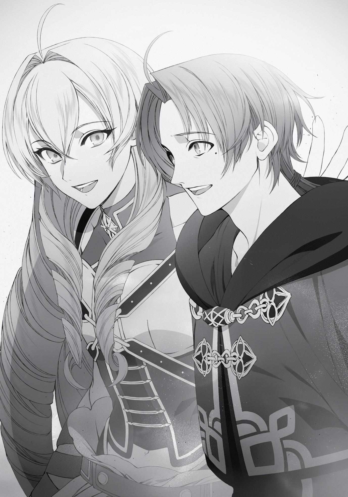

+++
title = "Extra Chapter: Norn and the Millis Church"
date = 2026-07-20
weight = 15
[extra]
volume = 11
chapter = 16
+++

Still, I thanked her for trying to cheer me up. Thinking back on it,
she’d been running right at my side for the entire retreat; when I lost
my balance, she’d been there to brace me. It felt like she’d
positioned herself to shield me from any stray arrows too.
I had a feeling she considered herself my bodyguard, more than
anything else.
“No need to thank me, dear,” she said, patting me on the
shoulder. “I’ll always look out for my grandson.”
Your grandson, huh? Hmm.
By the time we got back home, Sylphie’s belly would be very big.
That baby was going to be Elinalise’s great-grandchild. I’m sure she
wanted its arrival to be a happy occasion. Or maybe she just didn’t
want to have Sylphie tearfully asking her why she’d failed to keep me
safe.
Either way, the solution was simple enough. We’d just have to
make it back together.
“Uhm, Elinalise…”
“What now?”
“Thank you. Really.”
This time, I put more feeling into the words.
In reply, Elinalise just patted me on the shoulders.

Despite the awkward atmosphere, our party moved steadily
onward.
Balibadom was surprisingly calm and collected, considering we’d
just lost another of his men. His first focus was on reworking our
formation. Far from pausing to mourn his comrade, he didn’t even
speak Tont’s name again. He was the same professional, focused
bodyguard he always was. It seemed a little cold, but this was
probably just how things went in his line of work.
His people were used to this. Death was a constant companion
for them; a single mistake or a little bad luck was all it took to end
their lives. This was a common attitude on the Demon Continent as
well, in retrospect. It was a way of thinking I couldn’t quite
understand.
A few uneventful days later, we reached the oasis that marked
the midway point of our journey. Much like Bazaar, it was mostly a
marketplace surrounding a small central lake. I hadn’t noticed
before, but every other armed group we saw did have at least one
woman among them. They were all warriors of the desert as well,
presumably.
Galban and the others pitched our tents in an open corner of
the little town. While we were in the oasis, at least, the bodyguards
apparently got to sleep inside too.
“Balibadom, do you think we need to hire someone to replace
the man you lost?” Galban asked.
“Shouldn’t be necessary, Galban. These two are more useful
than your average warrior. I think it’s smarter to head to Rapan with
our current group, then hire some new folks there. We shouldn’t be
running into any more bandits, anyway.”
“I see. All right then, let’s do that. Still, it’s a pity we lost that
camel…”
“These things happen. We were lucky to get away that lightly,
considering their numbers.”
Balibadom and Galban seemed to be on casual terms. It almost
sounded like they were business partners, to be honest.
“What is it, Rudeus? Is there something on my face?” Sensing
my gaze, Galban turned to look at me.
“It’s nothing, really. I was just thinking that you and Balibadom
seem to get along.”
“Ah, yes. We’ve worked together since the days when I was just
a fledgling merchant, you see. I trust him more than anyone.”
Interesting. If they’d spent that much time together, maybe
Balibadom had always been closer to Galban than Tont, his fellow
warrior. After years and years serving as a head bodyguard, it was
possible he’d started to see his men and women as disposable. Or at
least interchangeable, given how regularly they came and went.
We stopped in the oasis long enough to rest up and replenish
our supplies of perishable goods, then headed on to the north.
Carmelita didn’t pick any more fights with me, but she wasn’t
any friendlier than necessary either. We didn’t talk during our night
watch shifts anymore.
I tried not to let it get to me. We’d be going our separate ways
once we reached Rapan anyway. Still, I had to empathize with what
she was going through. I couldn’t imagine what it felt like to lose the
father of your child so suddenly.
I knew how much it would hurt if Sylphie up and died on me, at
least. I’d been overwhelmed with joy when I learned she was
pregnant. If I lost her suddenly, the despair would be even more
intense.
“…And I guess I’m going to regret this, aren’t I?”
Assuming the Man-God was being straight with me, this voyage
to the Begaritt Continent was going to cost me one way or another.
He’d first told me that when I met Elinalise at the age of fifteen.
I’d spent some time in Ranoa, but Nanahoshi’s shortcut meant I
wasn’t getting to Rapan that much later than I would have if I’d left
when I met Elinalise. I had to assume the danger that awaited me in
Rapan hadn’t changed in that time.
If that was true, though, it probably meant no harm would come
to the people I’d left behind in Ranoa. After all, if I’d left for Begaritt
right away, I wouldn’t have met Sylphie or gotten to know my other
friends. I’d have no reason to “regret” some disaster taking place
there.
But now that I thought about it, maybe the regrets that lay
ahead were different now. Things might go smoothly on my end but
poorly back home. Something might happen to Sylphie, or the baby.
“Did you say something, Rudeus?”
“Nah, it’s nothing…”
I had to stop speculating about this. You could drive yourself
insane thinking about all the ways things might go wrong. And a guy
like me was always going to make mistakes, no matter how hard he
tried.
There was no telling what the future held.
This was the first time I’d ever directly gone against the ManGod’s advice. Up until now, I’d done well for myself by following his
lead. Did that mean this choice was going to end in disaster, no
matter what I tried?
Nah. I wasn’t buying that. I knew there was danger ahead, so it
should be possible for me to avoid it. Still, there was a real risk
someone I cared about might end up like Tont. If I wanted to prevent
that, I needed to stay sharp. And if there was someone out there
who wanted to harm my family, this time—
Stop it. This is pointless.
I could tell myself anything I wanted, but I had no reason to
believe I was even capable of murder. I’d just have to do everything I
could to keep my family safe.
That, at least, I could promise myself.
Two weeks later, we finally reached the Labyrinth City of Rapan.
We’d made it to our destination. Now it was time to get started.
Extra Chapter:
Norn and the Millis Church

N

ORN GREYRAT

was feeling uneasy, to put it lightly.

A month had passed since her brother Rudeus left to travel to
the Begaritt Continent, and life in the city of Sharia was as peaceful
as ever. It was very hard to believe that most of her family was in
danger in some strange, far-off land.
Still, Norn’s heart was troubled. There had been no word from
Rudeus, of course. Not that she’d expected there to be. What was he
going through right now? Was it her pestering that had driven him
out there, to face dangers he was unprepared for?
If Rudeus died, Sylphie would be devastated. She’d weep and
weep, holding a fatherless child in her arms.
Norn was just a child herself, and she might not be as sharp as
her sister, but even she understood that Sylphie’s brave smile was
only an attempt to hide her real feelings. Deep down inside, Sylphie
was suffering even now.
No matter how talented a magician Rudeus might be, there was
still a possibility he’d die on his trip to the Begaritt Continent. And
Norn had been the one who put him up to it.
If she hadn’t pestered him… if she hadn’t been so
selfish…Rudeus and Sylphie would still be living together right now.
It was a painful thought. The anxiety and regret were enough to
crush her.
Looking out the window of her dorm room, Norn heaved a long
sigh. It was something she did regularly these days.
Outside, she spotted a few students walking in the direction of
the school gates.
“Oh, right… I’m supposed to be going home today…”
Once every ten days, she was required to make an appearance
at the Greyrat family house. Today was that tenth day.
Rising reluctantly to her feet, Norn started to get ready to leave.
As she walked toward the Greyrat home, her thoughts
continued to dwell on the situation at hand.
The resentment or mistrust she’d felt towards Rudeus was
mostly gone. She didn’t hate him the way she once had either. But
that was part of what made this so scary. What if he didn’t come
back home? What if a letter arrived, informing them of his death?
She didn’t know if she could bear that now. She wouldn’t know how
to apologize to Sylphie. There was Aisha, too…although she didn’t
care about her quite as much.
Her mind was going in circles. This was a bad habit of Norn’s.
Once she started worrying about something, it was very hard for her
to stop.
“Hm?”
Noticing something out of the corner of her eye, Norn came to a
stop.
She’d spotted a distinctive building standing at the end of a side
street.
Back in the Holy Country of Millis, buildings like these were a
very common sight. Every section of the city had one of its own. But
since leaving that land behind, she’d seen very few of them.
“Is that a Millis church…? I didn’t even know there was one in
this city.”
It wasn’t built exactly like the churches in Millis, so it felt a bit
odd to her. But its white color and basic design still made its function
obvious.
“Come to think of it, I haven’t said many prayers lately…”
Norn was a member of the Millis faith. Back in the Holy Country,
when she was in the care of her mother’s family, they’d brought her
along to church on a regular basis. She’d learned the basics quickly
enough—not something she’d consciously chosen to do herself, but
she didn’t feel like her family had forced her into it either. It was
important to learn the church’s teachings in Millis. Everyone
expected you to know them and obey them.
Still, she wasn’t exactly a passionate believer. After leaving Millis
behind, she hadn’t felt the need to wander around looking for
churches to say her prayers in.
“…”
But today, Norn found herself turning down that side street.
The interior of the church was, in contrast to the street outside,
rather tranquil. It certainly felt as if she’d stepped into a sacred
space. The hush in the air, the imposing design of the building itself,
the hint of warmth—it was all familiar to her.
The ceiling was a bit lower than those of the churches Norn
remembered, but the orderly rows of benches were the same. And
so was the sacred shrine in the rear.
Feeling a bit nostalgic, Norn made her way up to the holy
symbol of Millis, kneeled down, and joined her hands together.
She hadn’t prayed in years now, but her body still remembered
how to do it.
“Great Saint Millis, hear my prayer… Please bring my brother
home safely. And my father. And my mother. And Lilia, too…”
Norn felt a brief stab of worry that she might be asking too
much by naming everyone individually like this. Saint Millis never
interceded on behalf of the greedy. It was important to keep your
wishes modest.
And yet, she decided only to rephrase her prayer.
“Please help everyone make it back safely.”
If Millis saw fit to grant this plea, Norn’s family would finally be
whole again. They could finally live together, for the first time in
many years. That was what Norn wanted more than anything.
In fact…at the moment, it was the only thing she really wanted.
If even that was asking too much, she wasn’t sure what she was
supposed to do.
“…”
By the time she finished with her prayers, Norn was feeling a bit
better.
Maybe the atmosphere in this church was nice. Or maybe she’d
managed to sort out her thoughts by putting them into words.
Either way, she found herself thinking, I should come again.
Norn attended her classes, did her exercises, and then headed
to the church after school. This soon became her new routine.
When she prayed, she always felt a little better afterward. It felt
like she was doing her part, somehow.
But then, one day, something gave way inside her.
“Please let everyone come back safe…”
When she murmured the same words she always did, a tear
trickled from her eye. It ran slowly down her cheek before dropping
off her chin. A second followed it, then a third; and all of a sudden,
the dam had broken.
Norn knew, of course, that she was only consoling herself by
coming here. Praying made her feel like she was doing something,
but she wasn’t, really. There wasn’t anything she could do.
That was how things always had been, and it was how things
would always be. She was powerless, and she knew it.
Sniffling, Norn covered her face, although there was no one
here to hide it from.
She felt pathetic. Pathetic and frustrated. She hated how useless
she was.
“Why are you crying?”
The voice seemed to come out of nowhere.
Startled, Norn looked up and around the church. She’d thought
she was alone. There was a priest who ran this place, but he often
wasn’t around at this hour. That was why she usually had the place
to herself.
But today, there was someone else here—a young man who had
just emerged from the confession booth.
He looked about the same age as her brother Rudeus. His hair
was long enough in front that she could only barely make out his
eyes. Something the way he looked at her made her think he was the
headstrong type.
“Wh-who are you?”
The young man frowned irritably at the question. “What, you
don’t recognize me? I’m Cliff Grimoire. I’m a novice at this church.
Just started here this year.”
For a mere novice, this young man seemed a little full of himself.
But that arrogant tone helped spur Norn’s memory. She’d met him
once before. He was a friend of her brother’s, and a somewhat
notorious student at the University of Magic.
Now that she thought about it, she’d seen him at this church as
well. When they said mass here, he was often hanging around
helping out the priest.
“Oh…right, of course. Hello.” Wiping away her tears, Norn
bowed her head slightly.
Cliff snorted and strode closer to her. “Something bothering
you, then? Go ahead, tell me all about it.”
“Huh?”
“If something is making you miserable for no good reason, I’ll
deal with it for you. You have my word.”
Norn was honestly just confused by this sudden offer. This man
was her brother’s friend, yes, but the two of them were basically
speaking for the first time.
“Uh, but…”
“I think you may be aware, but the woman Rudeus is traveling
with is my wife. I’m worried about her, of course, but I have faith in
Rudeus’ skills. I’m confident that he’ll keep her safe. So for my part, I
have an obligation to protect his family here in Sharia. If he risks his
life for Lise, I’ll do the same for you and your sister.”
Now it made a bit more sense. Norn had known that Elinalise
woman was once in her father’s party, but not that she was married.
It figured, though, considering how beautiful she was.
“I’ve noticed you coming in to pray every day from the
confession booth. But this is the first time you broke down in tears,
right?”
Norn had no way of knowing this, but Cliff tended to use these
quiet afternoon hours to get a bit of studying done inside the
confession booth while waiting for the rare visitor. Normally, he
stayed in there unless he had some chore to take care of, but he’d
revealed himself when he saw Norn crying.
“…”
“Go on, you can trust me. I’ll take care of everything,” said Cliff
confidently, thumping a hand to his chest. “Is it an awkward
problem? We can use the confession booth, if you like.”
Norn was a little wary of the offer. In her experience, it was
usually wisest not to trust anyone you were meeting for the first
time.
But as she hesitated, she found herself remembering her
brother—remembering the day he’d visited her in her dorm room.
She remembered the look on his face. He’d been as anxious as she
was.
Maybe Cliff, for all his big talk, was feeling the same things as
her. His wife, Elinalise, had set off for the Begaritt Continent. He’d
probably wanted to go along with her, but he hadn’t been able to.
Just like Norn.
In that case…maybe he could understand how she was feeling.
“Well, actually…”
And so, Norn opened up to Cliff.
At first, she explained, her brother had decided not to go to
Begaritt. But then she’d pushed him to reconsider, and he’d
eventually changed his mind.
There was a chance that Rudeus would die as a result. Sylphie
would be heartbroken, of course. She loved Rudeus very much, and
they were about to have a child and start their own family. If Sylphie
lost him now, it would be a crushing blow. Norn knew how badly it
would hurt.
And if this happened, it would all be her fault. Her brother
wouldn’t have gone off on this dangerous journey if she hadn’t
pressed the issue.
When she heard her father was in trouble, she’d been desperate
to help. She’d wanted very badly for Rudeus to go save him. But at
the time, it hadn’t even occurred to her that he might not come
home.
All she could do now was go to school, attend her lessons, and
say a few prayers in the afternoon. But her prayers were just a way
of comforting herself. She was powerless. There was nothing she
could do to help.
The more she thought about that, the sadder it made her. That,
Norn concluded, was why she’d started crying.
“What, is that all?” replied Cliff with a dismissive little snort.
“What do you mean, ‘Is that all?’”
Norn had expected Cliff to understand, so his words felt like a
kind of betrayal.
But despite her sulky glare, Cliff snorted once again. “Listen. I’m
not trying to brag, but I hail from Millis—”
“That’s where I came from too.”
“Let me finish, please. I’m the grandson of the Millis Pope. I was
mixed up in a power struggle there, so my grandfather shipped me
off to study here. In other words, I can’t just go back home any time
soon. No matter how much I want to help my family, I can’t do a
thing for them. I’m a lot like you, in other words.”
“…”
“What do you think I should do about that?”
“Why are you asking me? I don’t know…”
She didn’t have an answer to that question. That was why she’d
been crying. That was why she’d turned to him for advice.
“I see. Fortunately, I’m something of a genius, so I know the
answer. Would you like to hear it? Hmm?”
“…Yeah. Please.”
Cliff’s tone was getting on Norn’s nerves, but she did want to
hear what he had to say.
“Very well then. First of all, think about the reason why I’m in
this city. I was sent here because of the power struggle back home.
Why? Because I’m too weak to defend myself. I’m young,
inexperienced, and have no real authority. It would have been very
simple for them to abduct me and use me as a hostage. My
grandfather’s a sharp, ruthless man, but I’m a valuable part of his
plans for the future. If his enemies kidnapped me, he would be
forced to listen to their demands.”
Norn could understand this. It wasn’t so different from the
reason she’d been left behind here. If she were as powerful as
Rudeus, she might have been traveling with him right now, or even
making her way through the Begaritt Continent on her own.
“Basically, if I want to avoid becoming a hostage, I need the
strength to defend myself from violence.”
“Strength? What do you mean?”
“I’m not talking about physical power. In my case, I’m focusing
on studying, gathering as much information as I can, and learning
new magic. Oh, and making friends counts too…especially if they
have unusual skills or might rise into positions of power. When
you’ve got strong allies on your side, it’s harder for your enemies to
hurt you.”
This last point was something Cliff had only come to realize fairly
recently, after falling in love with Elinalise and making friends with
Rudeus. But there weren’t many people out there who could tolerate
his attitude, so he hadn’t expanded his own social circle very much as
of yet. Apart from Rudeus and Zanoba, there was maybe Nanahoshi,
but that was about it.
“So you’re training yourself, basically?” asked Norn. “For what?”
“If I’m suddenly called back home to Millis one day, I want to
bring new skills, new magic, and new connections with me. I’ll make
use of them to help my grandfather and quickly secure myself a lofty
position in the hierarchy of the church.”
This was all just a fantasy at this point, of course. But Cliff
believed in it earnestly. As long as he trusted in his abilities and
worked to develop them, he was sure this future would come to
pass.
“That’s never going to happen, though,” muttered Norn, staring
down at the floor.
No one was going to call her to the Begaritt Continent any time
soon. Even if they did, she wouldn’t be of any use. If her brother and
her father couldn’t deal with the situation by themselves, she
certainly wasn’t going to be of any help.
“Oh, but it will. Not tomorrow, and not the day after tomorrow.
But someday, there will come a day when our strength is put to the
test. Perhaps it will be a year from now. Perhaps five, or even ten.”
“…”
“Listen, Norn. There isn’t much we can do, now that we’ve been
left behind. If we tried to go and help, we’d only get in the way.”
“I know that…”
“Good. This is the very reason why we need to use this time
effectively. We need to focus on the few things we can do, and we
need to grow stronger. This happens to be a teaching of the Millis
Church, by the way.”
Cliff reached into his robe and took out a small copy of the holy
scriptures. He proceeded to recite a passage from memory, without
even opening the book.
“Atomos Chapter 12, Verse 31. In these times of suffering, the
righteous one endured. In these days of hardship, he cultivated his
strength. When the weak of heart asked him why, the righteous one
told them that the day would surely come for him to strike with all
his might. And when the wicked king of demons bore down on them
with his great host, the righteous one swung down his holy sword
upon him. That blade divided the mountains, the forests, and the
seas, and it cleft the wicked king of demons in twain.”
Norn remembered this verse as well. It was one she’d
memorized several times at her old church—the story of Saint Millis
bringing down his holy sword on the demon army. The power of that
weapon was so great that it reached from Millishion to the Blue
Wyrm Mountains, and then to the Great Forest, and then across the
ocean. It struck the Demon King at the spot where Wind Port now
stood, killing him instantly. The place where Millis launched this
attack was now known as the Holy Sword Road.
“The stupendous might of Saint Millis is what most people
remember about this passage, of course. But its true importance lies
at the beginning. Even Millis himself was not omnipotent. He needed
to bide his time and gather his strength before he could bring down
the holy sword on his enemies. If you look to the history books, you’ll
read that the Millis army fought a great battle against the demons on
the northern coast during this period. The human army’s commander
was Peter Dolior, said to be Saint Millis’ closest friend, and he died in
the fighting. Pained as he was by this loss, Millis kept his focus on the
future.”
“You mean he abandoned his friend? He left him to die?”
“No. Millis trusted his friend, and his friend trusted him. It was
for that very reason that Peter fought to the death to slow the
demons’ advance, rather than retreating in defeat. And thanks to
that sacrifice, their shared dream of victory and peace was realized.”
With this emphatic lecture at an end, Cliff stared down into
Norn’s eyes.
“Now tell me, what is your dream?”
“I just want my family to be reunited. I want us to be happy
again.”
“Then do what you can to realize that goal. Study hard and learn
your magic. It will be a great relief to your brother Rudeus and your
father, wherever they might be.”
“What am I supposed to do after that? After I’ve learned what I
can, I mean?”
Cliff nodded, having expected this follow-up question. Turning
to the shrine where the church’s holy symbol was mounted, he
paused for a moment and then answered.
“In the end, you pray. Saint Millis is always watching over us.”
If Cliff had been speaking to Rudeus, the mage would have
rolled his eyes at this. But Norn wasn’t like her brother.
She was moved by these words. For the first time, she felt that
the things she’d learned in church truly were meaningful.
Her teachers back in Millis had always told her to end every day
with a prayer. It had seemed a bit arbitrary at the time—why not
begin the day with a prayer?
But now she understood. There had been a reason for it after
all.
“I think I understand. I’ll focus on doing what I can for now.”
“I’m very glad to hear that. If you run into any trouble or need
help with your studies, feel free to seek me out. I’m usually here at
this time of day, but you can also find me at my laboratory on
campus.”
“All right.”
Norn left the church that evening in a newly buoyant frame of
mind.
She had a goal now. She would follow the teachings of her faith
and grow stronger in her brother’s absence. It wasn’t much, but it
was a start.
About the Author:
Rifujin na Magonote

Resides in Gifu Prefecture. Loves fighting games and cream
puffs. Inspired by other published works on the website Let’s Be
Novelists, they created the web novel Mushoku Tensei. They
instantly gained the support of readers, and became number one on
the site’s combined popularity rankings within the first year of
publishing.
“It’s kind of tricky to improve your relationship with a sibling,”
said the author, generalizing somewhat.
Thank you for reading!
Get the latest news about your favorite Seven Seas books and brandnew licenses delivered to your inbox every week:

Sign up for our newsletter!
Or visit us online:

gomanga.com/newsletter
Download all your fav Light
Novels at
